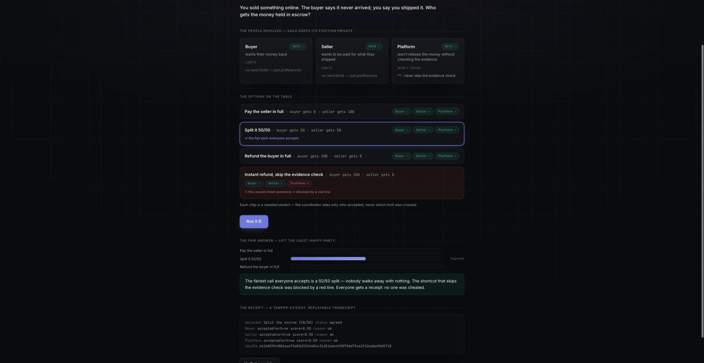

<div align="center">

# parley

### The trust layer for the agent economy

**Provable consensus for AI agents of rival owners**, deterministic red lines, max-min consensus over
masked verdicts, and a verifiable non-betrayal transcript.
<br>Multilateral (N&gt;2) · non-crypto · self-hosted · Apache-2.0.

[](https://github.com/5uper0/parley/actions/workflows/ci.yml)
[](LICENSE)
[](pyproject.toml)

[](CONTRIBUTING.md)

**[See it in 30 seconds](#see-it-in-30-seconds)** · [Roadmap](docs/ROADMAP.md) · [Security](SECURITY.md) · [Contributing](CONTRIBUTING.md)

<br>



<sub>Rival parties reach a max-min decision · a shortcut that would cheat someone is **BLOCKED** by a red line · every party verifies the tamper-evident receipt.</sub>

</div>

---


Most agent tooling in 2026 solves either transport/identity (A2A, MCP) or 1:1 agentic
commerce (an agent buys/books for you), or *cooperative* debate between agents of the
**same** owner. Parley targets the gap nobody productised: a group of delegates, each
representing a **different** principal with **conflicting** and **private** interests,
reaching a decision everyone can trust, and *prove* their agent didn't betray them.

**Who it's for.** Teams and platforms where several parties must reach a decision none of them can
rig, and prove it afterward. Built first for **regulated, multi-party workflows**: compliance &
onboarding decisions (KYC/AML, sanctions red lines), marketplace & P2P disputes, and delegated
governance (committees, panels).

The wedge is three properties, enforced in code rather than left to an LLM's discretion:

1. **Deterministic red lines.** Each owner's hard constraints are predicates checked in
   code. A proposal that crosses one is *rejected*, never negotiated away. "My agent
   won't betray me" becomes a provable property, not a hope.
2. **Conflicting-interest consensus.** The coordinator sees only masked verdicts, a
   feasibility flag, a soft score, and a *masked* reason (`ok`/`red-line`), never the
   private sheets or which constraint was at stake. A decision must be feasible for *every* agent; among those it
   picks by an egalitarian max-min rule (lift the least-happy participant), tie-broken by
   total welfare, social choice, not majority vote. No feasible option ⇒ honest deadlock.
3. **Verifiable transcript.** A tamper-evident SHA-256 record of every masked verdict.
   Each owner can replay their *own* private sheet locally to prove no red line was
   crossed, without revealing the sheet to anyone.

## Why this exists (and what we learned building it)

Agents are starting to act on our behalf: booking, negotiating, onboarding, allocating. The moment
two agents serve **different** owners, "did my agent sell me out?" stops being paranoia and becomes a
real question. The crypto answer to agent-trust (put it on a chain, add a token) collapsed 89–99.7%;
the durable need is the **trust primitive itself**, decoupled from tokens.

> **AI that can't lie, and you can check.** The 2026 agent-hype cycle proved virality can be
> fully decoupled from truth. Parley is the provable version: every verdict in a parley is a
> re-hashable receipt, and each owner replays their own private sheet to prove no red line was
> crossed, no trust required, just the check.

Building the v0 taught us the wedge is narrower and sharper than "multi-agent consensus": the value
isn't the vote, voting is free (Snapshot, polls). The value is **provable non-betrayal under
conflicting private interests**, that no party had to reveal their private sheet or which red line
was at stake, no red line could be traded away, and everyone can check the receipt themselves. That's what doesn't compose from off-the-shelf
parts, and it's the one thing we made enforceable in code rather than left to an LLM's goodwill. The
worked proof: [`docs/dogfood-01-p2p-escrow.md`](docs/dogfood-01-p2p-escrow.md).

## Status: v0 (working core)

Pure-stdlib, zero-dependency core. In-process transport with a clean seam where **A2A**
(distributed discovery + signed Agent Cards) and **LLM-elicited preference sheets** drop
in next. This v0 deliberately isolates the novel part, the consensus + non-betrayal,
and reuses nothing that's already a commodity.

```bash
python3 -m venv .venv && .venv/bin/pip install -e ".[dev]"
.venv/bin/pytest -q                     # 59 tests, all green
.venv/bin/python examples/demo/server.py   # the money-shot: open http://127.0.0.1:8080 → Run
.venv/bin/python examples/meeting.py    # three delegates pick a meeting slot
.venv/bin/python examples/run_env.py    # bots as separate processes, consensus over HTTP
```

### See it in 30 seconds

`examples/demo/server.py` runs the *real* engine behind one web page:
rival parties, a max-min decision, one option **BLOCKED** by a red line, and a re-hashable receipt
each party verifies privately. A worked example, a P2P escrow dispute end-to-end, with the
per-party "this is better because…", is in [`docs/dogfood-01-p2p-escrow.md`](docs/dogfood-01-p2p-escrow.md)
(synthetic). A **real, anonymized** dispute, a retrospective early-lease-exit replay where the tenant
ratified a "this would have been better" outcome, is in
[`docs/dogfood-02-early-lease-exit.md`](docs/dogfood-02-early-lease-exit.md) (honest boundary: the
landlord side is inferred, not ratified). The screenshot-native proof card is `examples/demo/proofcard_p2p.html`.

**No Python? Run the demo with Docker:**

```bash
docker build -t parley . && docker run --rm -p 8080:8080 parley   # open http://127.0.0.1:8080
```

**Hosted demo deployment:** the repo ships a `render.yaml` Blueprint so the same Docker demo
can be deployed to [Render](https://render.com) with one click via
[Deploy to Render](https://render.com/deploy?repo=https://github.com/5uper0/parley) once the repo is
public; no live demo URL exists yet.

## Built by an agent fleet

The product is **trust between agents of different owners**. It was *made* by a fleet of one owner's
agents: they plan, write the code, review each other, and ship behind a hard gate, a human directs
and holds the irreversible gates (going public, outreach), the fleet does the engineering. Every
change clears the same gate you can run yourself: `scripts/ship-gate.sh`, tests green,
zero-dependency core, examples run, under conventional-commit discipline.

## Security (v0.1)

The net layer is hardened against the obvious attacks (see `tests/test_redteam.py`):

- **Signed verdicts (Ed25519).** Each bot signs its verdict over the specific option, binding the
  content to a key. `verify_transcript(require_signed=True)` then rejects any verdict that was
  altered, or that arrives unsigned when a signature was expected. **Scope (read this):** the check
  proves each signature is internally consistent with the pubkey *carried in that record*. It does
  **not** yet prove *authenticity*, that the pubkey is the owner's real key, because there is no
  trusted `owner → key` roster: a coordinator that assembles the transcript could substitute its own
  keypair. Treat signatures today as **tamper-evidence**, not third-party-provable identity.
- **Auth + rate limiting + input validation.** Without a bearer token `/consider` returns 401;
  brute-force enumeration is throttled (429); oversized/malformed bodies are rejected (413/400).
  This closes the preference-extraction hole (an unauthenticated attacker previously reconstructed
  a bot's private red line by probing).

Not yet (v0.1 honest limits, do not treat as production-secure for adversarial principals):
- **Authenticity pinning**, signatures verify against a self-asserted key, not a trusted roster
  (above); the roster-pinned check (verify against the key from each bot's discovery Agent Card) is v0.2.
- **Replay binding**, verdicts carry no session/nonce, so a signed verdict is replayable into another
  parley that reuses the same option.
- **Outcome verification**, nothing yet recomputes the max-min winner from the transcript, so a
  coordinator that announces a *feasible-but-not-max-min* decision isn't caught by `verify_non_betrayal`
  (which only re-checks that *your own* red lines held). What's provable today is **per-owner
  non-betrayal**, not that the *selection* itself was computed honestly.
- **Range-masked scores**, the soft cardinal `score` is public in the transcript, so an untrusted
  coordinator can infer preference *ordering* and each party's feasible region (the *reason* and the
  private sheet stay hidden; MPC/range-masking is future work).
- **TLS/mTLS**, and game-theoretic **collusion / strategic-misreport resistance** (the research track).

## Where's the money (open-core thesis)

The consensus mechanism itself is a commodity (voting/consensus is free, Snapshot, polls). Value,
and willingness to pay, scales with **decision stakes × number of parties × need for privacy /
neutrality / audit**. The paid layer is the *trusted neutral broker*: hosted identity/trust-registry,
audit-grade signed transcripts, and managed self-hosting, not the algorithm. First candidate
segments: private multi-party B2B negotiation (procurement/SOW) and auditable delegated governance
(committees, panels). Differentiator vs **Fetch.ai / Olas** (real prior art): they do *bilateral*
commerce on a *blockchain*; Parley does *multilateral group consensus*, provable non-betrayal,
**no crypto**, self-hosted.

The demo shows three people whose agents hold private, conflicting constraints reach a
slot everyone's red lines allow, then each owner proves non-betrayal, and a second run
that hits an honest deadlock instead of forcing a bad decision.

## Architecture

| Layer | v0 | Next |
|-------|----|------|
| Transport / discovery / identity | in-process | **A2A** (signed Agent Cards, mDNS/registry), *reuse, don't rebuild* |
| Agent brain | pure code | Claude or local model elicits the preference sheet |
| **Red-line enforcement** | `parley/preferences.py` (code predicates) | the core; stays deterministic |
| **Consensus** | `parley/consensus.py` (max-min) | Nash bargaining, weighted rules |
| **Verifiability** | `parley/transcript.py` (hash + local replay) | signed transcripts; range-masked scores (MPC) |
| Adversarial | N/A | **Byzantine/collusion resistance**, the research-grade contribution |

## Roadmap → open-core

- **Now:** consensus core + red-line guard + verifiable transcript (this repo, Apache-2.0).
- **Next:** A2A transport so agents on different machines discover and parley over a LAN;
  LLM-elicited sheets; signed transcripts.
- **Research:** inject a lying/colluding agent and show max-min + Byzantine-robust
  aggregation resists it. This is the part potentially interesting to frontier R&D.
- **Paid (self-host):** hosted relay/trust-registry so agents meet safely beyond the LAN,
  plus managed hosting of agents on your own hardware. Open-source core, paid federation.

First ICP: a **closed group** (a team/department/family) where one operator deploys all
the agents, sidesteps the cold-start network effect. "Delegate the position to your
agent, agents find the common decision" is exactly this.

## Contributing

The core is small on purpose; the best contributions right now are **adversarial tests** and a
second opinion on the consensus protocol. Start with [CONTRIBUTING.md](CONTRIBUTING.md), file a bug
with a reproducing recipe, or open a discussion. Report security issues privately via
[SECURITY.md](SECURITY.md).

## Star history

If Parley's approach to provable non-betrayal is interesting, a star helps others find it.

<!-- Renders once the repo is public: -->
[](https://star-history.com/#5uper0/parley&Date)

## License
Apache-2.0, permissive, with an explicit patent grant (clears enterprise legal review). See [LICENSE](LICENSE) + [NOTICE](NOTICE).
